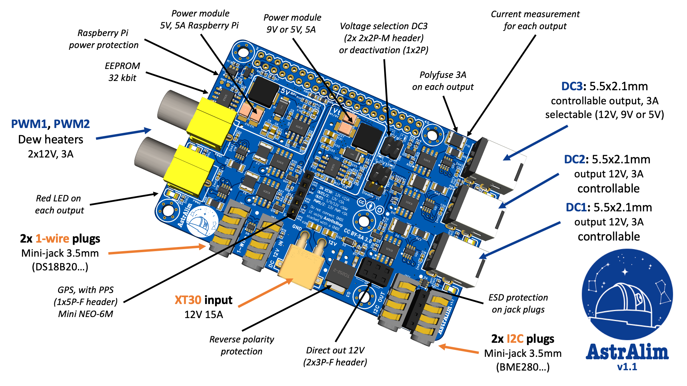

Project is published here : <https://oshwlab.com/pololamag/nafa-astralim>

**AstrAlim Hardware** : a telescope astrophotgraphy controller

 

Intended for amateur astronomers, based on the NAFAbox software solution (Nomad Astronomy For All, <https://github.com/Patrick-81/NAFABox),>  the Astralim card is designed as an add-on for a Raspberry Pi 5  mini-computer, aimed at managing the electrical aspects of an  astrophotography session. 

- a single 12V DC input in 2.1/5.5mm format,
- a single power cable to reduce jamming and friction when moving your telescope,
- 3 DC outputs of 12V in 2.1/5.5mm  format, to power focus motors, cameras, and wheels. One of these three  outputs has a voltage selectable from 12V, 9V or 5V. For each of these  three outputs, the current is measured via an INA219.
- 2 RCA-format 12V PWM outputs to power  up to 2 dew heaters, which are controllable to adjust their respective  power levels. For each of these two outputs, the current is measured via  an INA219.
- 2 temperature (1-wire) and humidity (i2c) sensor to trigger and adjust dew heaters according to the local dew point,
- 1 GPS module, with PPS output, to provide accurate time and positioning for nomadic astrophotography sessions.

 

In summary: With the RPI5, Astralim  represents a reliable, powerful, and energy-efficient solution, perfect  for both fixed installations and nomadic use. This solution allows you  to forego conventional and expensive proprietary systems, offering all  the functions you could need.
